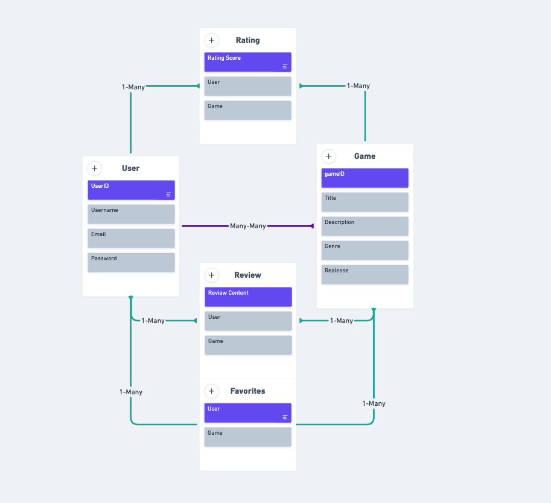

# GameStack

## Date 7/7/23

---

### By: Savino Lugo

[GitHub](https://github.com/SavinoLugo) | [LinkedIn](https://www.linkedin.com/in/savinolugo/) | [Trello](https://trello.com/b/BM1Z4kGo/gamestack)

---

## **_Description_**

The Video Game Library is a user-friendly web application where users can search for video games, add them to their personal library, rate them, and write reviews. Users can also filter games based on platform, genre, and release year.

---

## **_Getting started_**

---

## **_Resources_**
